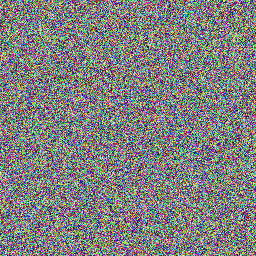
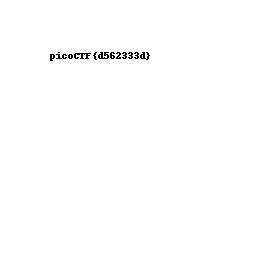

# Pixelated
### Author: Sara
### Cryptography: 100 points

I have these 2 images, can you make a flag out of them? [scrambled1.png](scrambled1.png) [scrambled2.png](scrambled2.png)

---

Using [stegsolve](https://github.com/zardus/ctf-tools/blob/master/stegsolve/install), open one of the images, then use Analyze -> Image Combiner, opening the second image. Click on the right arrow until you get to ADD. The [output image](solved.png) is your flag.

flag: `picoCTF{d562333d}`
